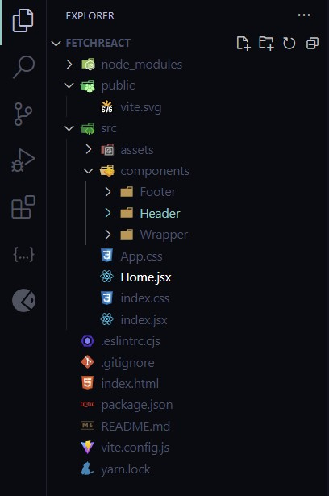

# React + Vite + Yarn.

By default uses Css, but added **Sass** if needed.

This template provides a minimal setup to get React working in Vite with HMR and some ESLint rules.

Currently, two official plugins are available:
